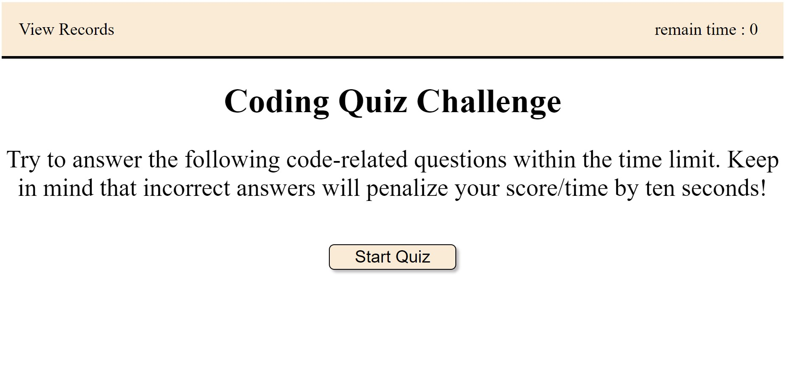

# 4th-Web-APIs-Challenge-Code-Quiz

## Description

This project was created to create an application for code quiz. It contains notes on HTML, CSS and JavaScript.

I create a application that has a timed coding quiz with multiple-choice questions that meets certain criteria.

This app runs in the browser, and features dynamically updated HTML and CSS powered by JavaScript code that you write.

I learned how to use global scope to affect each funtions or Conditional-Statements etc to associate each other. Also I learned how to design and implement an algorithm to make this quiz to execute as a infinite loop.

## Installation

N/A

## Usage

To understand the code that I code, please read the comments in JavaScript file.
 

This is instruction how works this quiz.

1. Once click Start Quiz button, The quiz will be started and the timer start which have 75 seconds. 

2. When you answer the question, the next question will be presented.

3. If you answer a question incorrectly, time is subtracted from the clock. (-10 secs)

4. When all questions are answered or the timer reaches 0,
 the game will be over.

5. When the game is over, you can save your initials and score
 

* If you click view record text, the record page will pop up.

* If you click clear high score button, the records in record page will be deleted.

* If you click Go-back button, the quiz goes back to first page and you can start game again.

* If you do quiz more than a time, the score will be stack in record page.

* This quiz will be execute as a infinite loop. The more you play, the more score will be stack up on record page.
 

URL = https://kayden-hyunsikkim.github.io/4th-Web-APIs-Challenge-Code-Quiz/  

(screenshot image could be slitely different with the web application)

## Credits

N/A

## License

N/A
